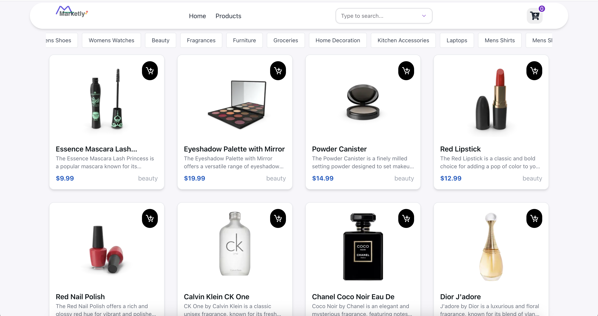
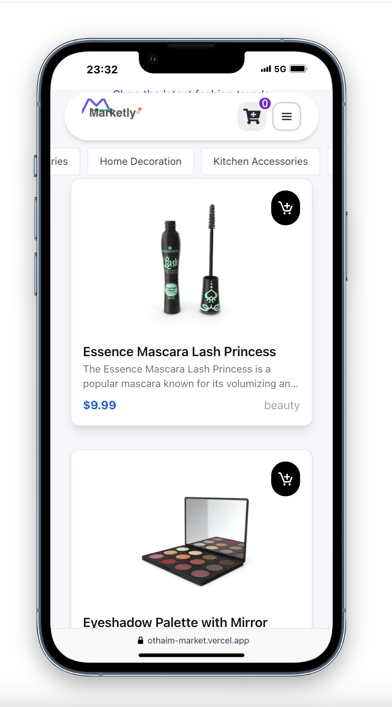

# Othaim-market 


A cutting-edge fashion e-commerce platform featuring modern UI components, smooth animations, and robust state management.

## ✨ Demo

[](https://othaim-market.vercel.app/)

 
## 📸 Application Preview

| Desktop View | Mobile View |
|--------------|-------------|
|  |  |
## 🚀 Features

- **Hero UI Components** (@heroui integration)
- **Smooth Animations** (Framer Motion)
- **Interactive Product Carousels** (Swiper)
- **Form Validation** (React Hook Form + Zod)
- **State-of-the-Art State Management** (Zustand)
- **Data Fetching** (TanStack Query)
- **Responsive Design** (Tailwind CSS)
- **Infinite Scroll** (React Intersection Observer)
- **Performance Optimization** (React Query Caching)
- **Testing** (Jest)

## 📦 Installation

```bash
# Clone the repository
git clone https://github.com/SaLim-Sayed/othaim-task
cd othaim-task

# Install dependencies
npm install

# Start development server
npm run dev